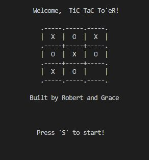
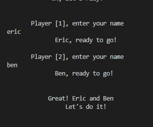
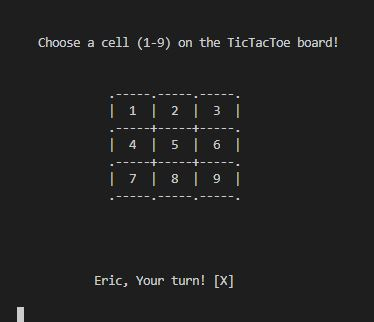
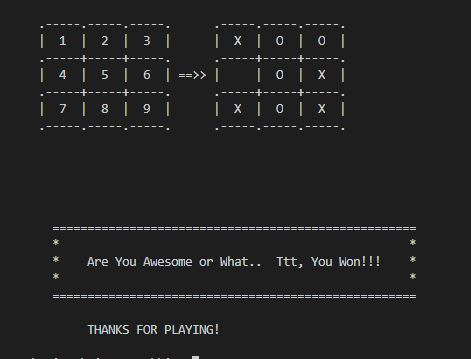
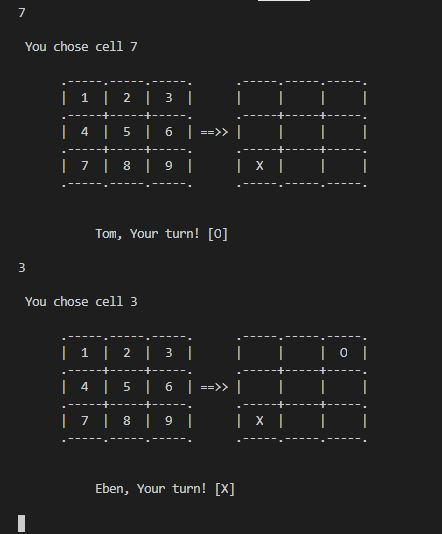

# Tictactoe Game clone

This game project is an implementation of a 3X3 grid Tic Tac Toe game for interecative console play, developed using Ruby language. Checkout the demo game [here](https://repl.it/@rloterh/FlatWavyQuadrant#main.rb)

## Introduction
Tic tac toe is a 2 player game where the player X and O takes turns filling a 3 x 3 grid.
Any of the players who first places 3 respective marks in a horizontal, vertical or diagonal manner wins the game.
It's a draw when all the mark points on the board are full and none of the players is able to achieve the above mentioned
3 respective marks on the board. Enjoy playing this game, and leave us a feedback!

  

## Game Instructions

- When game is run Welcome screen is shown. Press 'S' when you're ready to play
- Player one and player two, enters names to get ready
- Follow the play instructions: Choose a cell [1-9]on the board as indicated in the display.
  - Each player chooses an emtpty cell on the board during his/turns.
  - The player who's the first to align 3 respective cells on the board (horizontal,vertical or diagonal) is the winner.
  - When cells on the board are full, and none of the 2 players fills 3 respective cells (horizontal,vertical or diagonal), it's a draw.

| | | |
|:-------------------------:|:-------------------------:|:-------------------------:|
|  Welcome screen |  Players Intro| Game instructions|
| Game conclusion |   Game play|

## Getting Started
- Run game using the demo link [here](https://repl.it/@rloterh/FlatWavyQuadrant#main.rb)
- In terminal, with Ruby installed, navigate *bin* diractory and run **_ruby main.rb_**
- Run bash executable in the terminal using command **_./main.rb_** 

## Built With

- Ruby
- Rubocop
- rspec

## Authors

👤 **Grace Popoola**

- Github: [@githubhandle](https://github.com/GraceOyiza)
- Twitter: [@twitterhandle](https://twitter.com/_PopsonGrace)
- Linkedin: [linkedin](https://www.linkedin.com/in/grace-popoola-657a181aa/)

👤 **Robert Loterh**

- Github: [@githubhandle](https://github.com/rloterh )
- Twitter: [@twitterhandle](https://twitter.com/RLoterh )
- Linkedin: [linkedin](https://www.linkedin.com/in/robert-loterh-30b265135/)

## 🤝 Contributing

Contributions, issues and feature requests are welcome!

Feel free to check the [issues page](issues/).

## Show your support

Give a ⭐️ if you like this project!

## Acknowledgments

- Special thanks to [BRILLIANT](https://brilliant.org/) for using their Tictactoe animated gif image in our ReadMe
- Hat tip to anyone whose code was used
- Inspiration
- etc

## 📝 License

This project is [MIT](lic.url) licensed.
